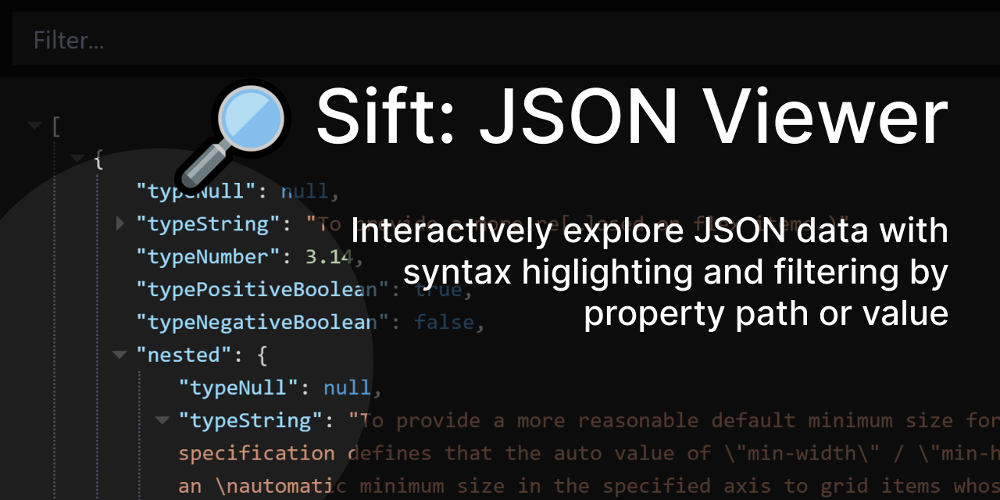

# Sift

🔎 Sift is an interactive JSON viewer.

This project is part of [#CreateWeekly](https://dev.to/josephuspaye/createweekly-create-something-new-publicly-every-week-in-2020-1nh9), my attempt to create something new publicly every week in 2020.

## Features

Sift allows you to:

- View JSON documents with syntax highlighting
- Expand and collapse sections, filter by path, and filter by value
- View document in light or dark mode
- View plaintext or interactive JSON

## What's next

- Demo: remember loaded JSON document (localstorage)
- Demo: remember theme selection

## Contributing

See [contribution guide](CONTRIBUTING.md).

## Licence

[MIT](LICENCE)
